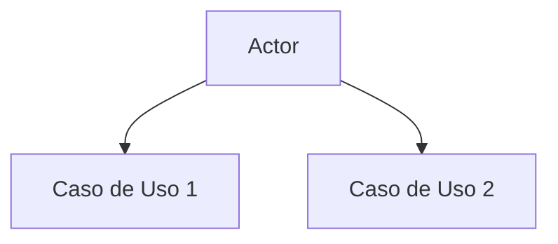
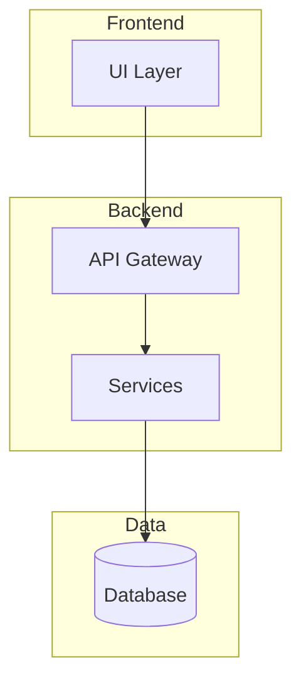
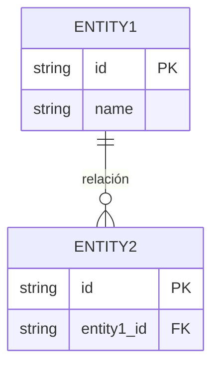
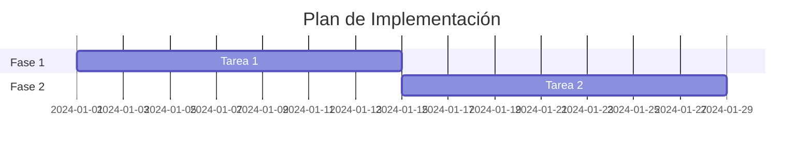
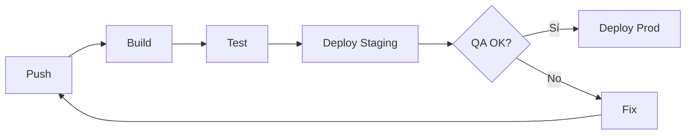

# {{PROJECT_NAME}}

> **Documento Técnico de Diseño de Software — SDLC**
> 
> {{PROJECT_DESCRIPTION}}
> 
> 📅 Creado: {{DATE}} · 📐 Generado con [Projector](https://github.com/projector-ai/projector)

---

## Índice

1. [Planteamiento del Problema](#1-planteamiento-del-problema)
2. [Requerimientos](#2-requerimientos)
3. [Análisis](#3-análisis)
4. [Diseño del Sistema](#4-diseño-del-sistema)
5. [Diseño Detallado](#5-diseño-detallado)
6. [Plan de Implementación](#6-plan-de-implementación)
7. [Estrategia de Testing](#7-estrategia-de-testing)
8. [Despliegue y Operaciones](#8-despliegue-y-operaciones)
9. [Resumen Ejecutivo](#9-resumen-ejecutivo)

---

## 1. Planteamiento del Problema

<!-- PHASE:problem-statement:STATUS:pending -->

> 🔲 **Fase pendiente** — Describe el problema que se busca resolver.

### Contexto

_Por definir._

### Problema Principal

_Por definir._

### Impacto

_Por definir._

---

## 2. Requerimientos

<!-- PHASE:requirements:STATUS:pending -->

> 🔲 **Fase pendiente** — Funcionales, no funcionales y restricciones.

### Requerimientos Funcionales

| ID | Requerimiento | Prioridad |
|----|--------------|-----------|
| RF-001 | _Por definir_ | Alta |

### Requerimientos No Funcionales

| ID | Requerimiento | Métrica |
|----|--------------|---------|
| RNF-001 | _Por definir_ | _Por definir_ |

### Restricciones

_Por definir._

---

## 3. Análisis

<!-- PHASE:analysis:STATUS:pending -->

> 🔲 **Fase pendiente** — Casos de uso, actores y reglas de negocio.

### Actores del Sistema

| Actor | Descripción |
|-------|------------|
| _Por definir_ | _Por definir_ |

### Casos de Uso

### Reglas de Negocio

_Por definir._

---

## 4. Diseño del Sistema

<!-- PHASE:system-design:STATUS:pending -->

> 🔲 **Fase pendiente** — Arquitectura, componentes y diagramas.

### Arquitectura General

### Stack Tecnológico

| Capa | Tecnología | Justificación |
|------|-----------|---------------|
| Frontend | _Por definir_ | _Por definir_ |
| Backend | _Por definir_ | _Por definir_ |
| Base de Datos | _Por definir_ | _Por definir_ |

### Componentes

_Por definir._

---

## 5. Diseño Detallado

<!-- PHASE:detailed-design:STATUS:pending -->

> 🔲 **Fase pendiente** — Modelos de datos, APIs e interfaces.

### Modelo de Datos

### Diseño de API

| Método | Endpoint | Descripción |
|--------|----------|-------------|
| GET | `/api/v1/resource` | _Por definir_ |

### Interfaces de Usuario

_Por definir._

---

## 6. Plan de Implementación

<!-- PHASE:implementation-plan:STATUS:pending -->

> 🔲 **Fase pendiente** — Sprints, tareas y prioridades.

### Fases de Desarrollo

### Priorización

| Sprint | Entregable | Duración |
|--------|-----------|----------|
| Sprint 1 | _Por definir_ | 2 semanas |

---

## 7. Estrategia de Testing

<!-- PHASE:testing-strategy:STATUS:pending -->

> 🔲 **Fase pendiente** — Unitarios, integración y E2E.

### Niveles de Testing

| Nivel | Herramienta | Cobertura Objetivo |
|-------|-----------|-------------------|
| Unitario | _Por definir_ | 80% |
| Integración | _Por definir_ | 70% |
| E2E | _Por definir_ | Flujos críticos |

### Criterios de Aceptación

_Por definir._

---

## 8. Despliegue y Operaciones

<!-- PHASE:deployment-operations:STATUS:pending -->

> 🔲 **Fase pendiente** — CI/CD, infraestructura y monitoreo.

### Pipeline CI/CD

### Infraestructura

_Por definir._

### Monitoreo

_Por definir._

---

## 9. Resumen Ejecutivo

<!-- PHASE:executive-summary:STATUS:pending -->

> 🔲 **Fase pendiente** — Síntesis del diseño completo.

### Visión General

_Se generará automáticamente al completar todas las fases._

### Decisiones Clave

_Por definir._

### Riesgos Identificados

| Riesgo | Probabilidad | Impacto | Mitigación |
|--------|-------------|---------|------------|
| _Por definir_ | _Por definir_ | _Por definir_ | _Por definir_ |

---

📐 Generado con [Projector](https://github.com/projector-ai/projector) · SDLC Workflow · Asistido por Antigravity
